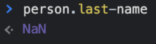
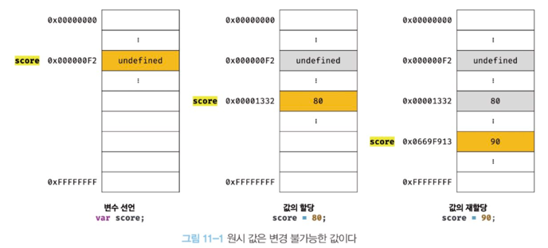
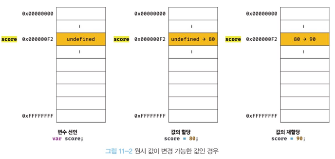
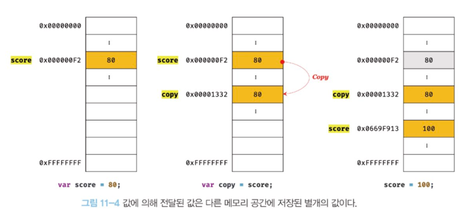
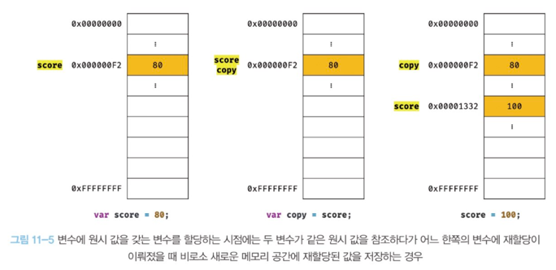

# 10. 객체 리터럴

## 객체 생성 방식은?
- 객체 리터럴
- Object 생성자 함수
- 생성자 함수
- Object.create 메서드
- 클래스(ES6)

## 프로퍼티
객체는 프로퍼티의 집합이며, 프로퍼티는 키와 값으로 구성된다
`프로퍼티 키` : 빈 문자열을 포함하는 모든 문자열 또는 심벌 값
프로퍼티 값 : 자바스크립트에서 사용할 수 있는 모든 값

식별자 네이밍 규칙을 따른다면 따옴표를 사용하지 않고 프로퍼티 키로 사용할 수 있다.
```jsx
var person = {
  firstName: 'Ung-mo', // 식별자 네이밍 규칙을 준수하는 프로퍼티 키
  'last-name': 'Lee'   // 식별자 네이밍 규칙을 준수하지 않는 프로퍼티 키
};

console.log(person); // {firstName: "Ung-mo", last-name: "Lee"}
```

## 프로퍼티 접근 방식 .과 []의 차이
- 마침표 프로퍼티 접근 연산자(`.`)를 사용하는 마침표 표기법
- 대괄호 프로퍼티 접근 연산자(`[...]`)를 사용하는 대괄호 표기법
    - [] 내부에 지정하는 프로퍼티 키는 반드시 따옴표로 감싼 문자열이어야 한다
    - 따옴표로 감싸지 않은 이름은 식별자로 인식하여 ReferenceError가 발생한다. 식별자를 평가하기 위해 선언된 이름을 찾았지만 찾지 못했기 때문이다.

```jsx
var person = {
  name: 'Lee',
  1: 10
};

// 마침표 표기법에 의한 프로퍼티 접근
console.log(person.name); // Lee

// 대괄호 표기법에 의한 프로퍼티 접근
console.log(person['name']); // Lee

console.log(person[name]); // ReferenceError: name is not defined

console.log(person.age); // undefined

// 프로퍼티 키가 숫자로 이뤄진 문자열인 경우 따옴표를 생략할 수 있다.
person.1;     // -> SyntaxError: Unexpected number
person.'1';   // -> SyntaxError: Unexpected string
person[1];    // -> 10 : person[1] -> person['1']
person['1'];  // -> 10
```

객체에 존재하지 않는 프로퍼티에 접근하면 undefined를 반환한다.
ReferenceError를 발생하지 않는다는 점에 주의하자.

프로퍼티 키가 식별자 네이밍을 준수하지 않는 이름을 사용하면 반드시 대괄호 표기법을 사용해야 한다. 단, 프로퍼티 키가 숫자로 이뤄진 문자열일 경우 따옴표를 생략할 수 있다. 그 외에는 반드시 따옴표로 감싼 문자열이어야 한다

```jsx
var person = {
  'last-name': 'Lee',
};

person.'last-name';  // -> SyntaxError: Unexpected string
person.last-name;    // -> 브라우저 환경: NaN
                     // -> Node.js 환경: ReferenceError: name is not defined
person[last-name];   // -> ReferenceError: last is not defined
person['last-name']; // -> Lee
```
person.last-name 의 실행결과가 브라우저 환경과 Node.js 환경에서 다른 이유는?

자바스크립트 엔진은 먼저 person.last를 평가한다. person 객체에는 프로퍼티 키가 last인 프로퍼티가 없기 때문에 person.last는 undefined로 평가된다. 따라서 person.last-name은 undefined - name 과 같다. 다음으로 name을 찾는다. 이 때 name은 따옴표로 감싸져 있지 않고 식별자 네이밍 규칙을 따르므로 프로퍼티 키가 아니라 식별자로 해석된다.

- 브라우저 환경 : 전역 변수 name은 window를 가리키며 기본값은 빈 문자열이기 때문에 undefined - ''과 같으므로 NaN이 된다
    - 
- Node.js 환경 : 어디에도 name 이라는 식별자가 없으므로 레퍼런스 에러가 발생한다.

# 11. 원시 값과 객체의 비교

### 원시 타입과 객체 타입의 차이점을 설명하시오
- 원시 타입의 값은 변경 불가능한 값(immutable value)이고 객체 타입의 값은 변경 가능한 값(mmutable value)이다
- 원시 값을 변수에 할당하면 변수(확보된 메모리 공간)에는 실제 값이 저장되지만 객체를 변수에 할당하면 변수에는 참조 값이 저장된다.
- 원시 값을 갖는 변수는 다른 변수에 할당하면 원본이 원시 값이 복사되어 전달된다. 이를 값에 의한 전달(pass by value)이라 한다. 객체를 가리키는 변수를 다른 변수에 할당하면 원본의 참조 값이 복사되어 전달된다. 참조에 의한 전달(pass by value)

![[Pasted image 20221009201508.png]]

![[Pasted image 20221009201515.png]]

변수 값을 변경하기 위해 원시 값을 재할당하면 새로운 메모리 공간을 확보하고 재할당한 값을 저장한 후, 변수가 참조하던 메모리 공간의 주소를 변경한다. 이를 `불변성`이라 한다.


## 값에 의한 전달


![[Pasted image 20221009204322.png]]


```jsx
var score = 80;

// copy 변수에는 score 변수의 값 80이 복사되어 할당된다.
var copy = score;

console.log(score, copy);    // 80  80
console.log(score === copy); // true

// score 변수와 copy 변수의 값은 다른 메모리 공간에 저장된 별개의 값이다.
// 따라서 score 변수의 값을 변경해도 copy 변수의 값에는 어떠한 영향도 주지 않는다.
score = 100;

console.log(score, copy);    // 100  80
console.log(score === copy); // false
```

중요한 것은, 두 변수의 원시 값은 서로 다른 메모리 공간에 저장된 별개의 값이 되어 어느 한쪽에서 재할당을 통해 값을 변경하더라도 서로 간섭할 수 없다

## 객체
해시테이블
https://ko.wikipedia.org/wiki/%ED%95%B4%EC%8B%9C_%ED%85%8C%EC%9D%B4%EB%B8%94

**해시 테이블**(hash table), **해시 맵**(hash map), **해시 표**는 [컴퓨팅](https://ko.wikipedia.org/wiki/%EC%BB%B4%ED%93%A8%ED%8C%85 "컴퓨팅")에서 [키](https://ko.wikipedia.org/wiki/%EA%B3%A0%EC%9C%A0_%ED%82%A4 "고유 키")를 [값](https://ko.wikipedia.org/wiki/%EA%B0%92_(%EC%BB%B4%ED%93%A8%ED%84%B0_%EA%B3%BC%ED%95%99) "값 (컴퓨터 과학)")에 매핑할 수 있는 구조인, [연관 배열](https://ko.wikipedia.org/wiki/%EC%97%B0%EA%B4%80_%EB%B0%B0%EC%97%B4 "연관 배열") 추가에 사용되는 [자료 구조](https://ko.wikipedia.org/wiki/%EC%9E%90%EB%A3%8C_%EA%B5%AC%EC%A1%B0 "자료 구조")이다. 해시 테이블은 [해시 함수](https://ko.wikipedia.org/wiki/%ED%95%B4%EC%8B%9C_%ED%95%A8%EC%88%98 "해시 함수")를 사용하여 색인(index)을 버킷(bucket)이나 슬롯(slot)의 배열로 계산한다.
![[Pasted image 20221009210932.png]]

자바스크립트 엔진이 객체를 어떻게 관리하는지?

Fast properties in V8 : https://v8.dev/blog/fast-properties

V8 히든 클래스 이야기 : https://engineering.linecorp.com/ko/blog/v8-hidden-class/

자바스크립트 엔진의 최적화 기법 (2) : https://meetup.toast.com/posts/78

Breaking the Javscript Speed Limit with V8 : https://www.youtube.com/watch?v=UJPdhx5zTaw


### 얕은 복사와 깊은 복사
얕은 복사는 한 단계까지만 복사, 깊은 복사는 객체에 중첩되어 있는 객체까지 모두 복사
```jsx
const o = { x: { y: 1 } };

// 얕은 복사
const c1 = { ...o }; // 35장 "스프레드 문법" 참고
console.log(c1 === o); // false
console.log(c1.x === o.x); // true

// lodash의 cloneDeep을 사용한 깊은 복사
// "npm install lodash"로 lodash를 설치한 후, Node.js 환경에서 실행
const _ = require('lodash');
// 깊은 복사
const c2 = _.cloneDeep(o);
console.log(c2 === o); // false
console.log(c2.x === o.x); // false
```
얕은 복사는 객체에 중첩되어 있는 객체의 경우 참조 값을 복사하고 깊은 복사는 객체에 중첩되어 있는 객체까지 모두 복사해서 원시 값처럼 완전한 복사본을 만든다는 차이가 있다

```jsx
const v = 1;

// "깊은 복사"라고 부르기도 한다.
const c1 = v;
console.log(c1 === v); // true

const o = { x: 1 };

// "얕은 복사"라고 부르기도 한다.
const c2 = o;
console.log(c2 === o); // true
```

### 퀴즈
```jsx
var person1 = {
  name: 'Lee'
};

var person2 = {
  name: 'Lee'
};

console.log(person1 === person2); // ①
console.log(person1.name === person2.name); // ②
```

1은 false
2는 true

![[Pasted image 20221009212904.png]]

# 12. 함수

# 13. 스코프

# 14. 전역 변수의 문제점

# 15. let, const 키워드와 블록 레벨 스코프