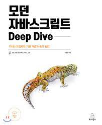

# 💙 모던자바스크립트 Deep Dive 스터디

## 🐥 스터디 멤버

|       |   |  |  |
|:------------------------------------------------:|:--------------------------------------------:|:---------------------------------------------:|:--------------------------------------------:|
|         [김효진](https://github.com/hy57in)         |       [김민지](https://github.com/mnxmnz)       |      [이병현](https://github.com/Tolluset)       |      [이상조](https://github.com/sjoleee)       |
|                자바스크립트 체화가 목표 🎅🏻                |             책 내용 최대한 많이 흡수하기 🤔              |      읽으면서 궁금한 것들 많이 찾아보고 직접 해보기 🧐       |              벼락치기 하지않고 잘 읽기 📖               |
|    |  |  |  |
|       [박상범](https://github.com/sangbooom)        |      [김록원](https://github.com/RokwonK)       |      [박수진](https://github.com/sujin-park)       |      [천승아](https://github.com/1000peach)       |
|                 자바스크립트 기본기 마스터가 목표 📚                 |        코드에 적용할 수 있게 실용적으로 공부하기🧑🏻‍💻         |                  |     자바스크립트 기본과 원리 제대로 이해하기 🏃     |

## 스터디 시간

일시 : 매주 일요일 22:00 ~ 23:00

장소 : 게더타운

## 스터디 공통 목표

1. 꾸준히 공부한다.
2. 인사이트를 얻는다.

## 스터디 전 준비 사항

- 책 읽기
- 회차 폴더 안에 {이름}.md 파일 안에 공유할 내용 정리하기
  - 공부한 내용 정리
  - 질문(면접 질문 느낌)
  - 토론 주제 적어오기
  - 인상 깊은 점
  - 새로 알게된 개념

## 📚 스터디 진행방식

- 룰렛 돌려서 걸린 사람이 진행
- 진행자가 스터디 기록하기
- 진행자가 먼저 공유할 내용(질문) 발표
- 각자 적어온 질문 공유, 답변해보기
- 공부해 온 주제에 대해 자유롭게 토론, 인사이트 공유
- 정적이 흐르면 진행자가 토론 유도
- 4:4 로 나누는것도 고려

## 스터디 규칙

- 불참시 벌금 1만원
- 일주일 전에 이야기하면 벌금 X (예정된 일정 등에 사용)
- 진행자로 선정되었는데 준비를 안해왔으면 옐로카드 1장
- 지각은 10분까지 인정. 이후에 들어오면 옐로카드 1장
- 옐로카드 2장 = 벌금 1만원

## 🗓 스터디 일정

| 회차 | 일시                | 목차                | 참여자               | 발표자 | 비고                       |
| ---- |-------------------|-------------------|-------------------|-----|--------------------------|
| 0    | 9월 25일 (일) 22:00  | 스터디룰 정하기          | 수진,승아 외 All       |     ||
| 1    | 10월 02일 (일) 22:10 | 4,5,6,7,8,9       | All               | 록원  | 희면, 예솔 new 멤버, 용호님 참관    |
| 2    | 10월 09일 (일) 22:00 | 10,11,12,13,14,15 | 상범,수진 외 All       | 민지  ||
| 3    | 10월 16일 (일) 22:00 | 16,17,18          | 수진,희면,예솔,록원 외 All | 민지  ||
| 4    | 10월 23일 (일) 22:00 | 19,20,21          | 승아,희면,상조 외 All    | 예솔  | 성용님 참관, framer-motion 특강 |
| 5    | 10월 30일 (일) 22:00 | 22,23             |                   ||
| 6    | 11월 06일 (일) 22:00 | 24,25,26          |                   ||
| 7    | 11월 13일 (일) 22:00 | 38,39             |                   ||
| 8    | 11월 20일 (일) 22:00 | 40,42,41,43       |                   ||
| 9    | 11월 27일 (일) 22:00 | 45,46,47,48       |                   ||
| 10   | 12월 04일 (일) 22:00 |                   |                   ||
| 11   | 12월 11일 (일) 22:00 |                   |                   ||
| 12   | 12월 18일 (일) 22:00 |                   |                   ||
| 13   | 12월 25일 (일) 22:00 |                   |                   ||
| 14   | 01월 01일 (일) 22:00 |                   |                   ||

## 📍 목차

 <b> 목차 </b>  

▣ 01장: 프로그래밍
1.1 프로그래밍이란?
1.2 프로그래밍 언어
1.3 구문과 의미

▣ 02장: 자바스크립트란?
2.1 자바스크립트의 탄생
2.2 자바스크립트의 표준화
2.3 자바스크립트 성장의 역사
____2.3.1 Ajax
____2.3.2 jQuery
____2.3.3 V8 자바스크립트 엔진
____2.3.4 Node.js
____2.3.5 SPA 프레임워크
2.4 자바스크립트와 ECMAScript
2.5 자바스크립트의 특징
2.6 ES6 브라우저 지원 현황

▣ 03장: 자바스크립트 개발 환경과 실행 방법
3.1 자바스크립트 실행 환경
3.2 웹 브라우저
____3.2.1 개발자 도구
____3.2.2 콘솔
____3.2.3 브라우저에서 자바스크립트 실행
____3.2.4 디버깅
3.3 Node.js
____3.3.1 Node.js와 npm 소개
____3.3.2 Node.js 설치
____3.3.3 Node.js REPL
3.4 비주얼 스튜디오 코드
____3.4.1 비주얼 스튜디오 코드 설치
____3.4.2 내장 터미널
____3.4.3 Code Runner 확장 플러그인
____3.4.4 Live Server 확장 플러그인

▣ 04장: 변수
4.1 변수란 무엇인가? 왜 필요한가?
4.2 식별자
4.3 변수 선언
4.4 변수 선언의 실행 시점과 변수 호이스팅
4.5 값의 할당
4.6 값의 재할당
4.7 식별자 네이밍 규칙

▣ 05장: 표현식과 문
5.1 값
5.2 리터럴
5.3 표현식
5.4 문
5.5 세미콜론과 세미콜론 자동 삽입 기능
5.6 표현식인 문과 표현식이 아닌 문

▣ 06장: 데이터 타입
6.1 숫자 타입
6.2 문자열 타입
6.3 템플릿 리터럴
____6.3.1 멀티라인 문자열
____6.3.2 표현식 삽입
6.4 불리언 타입
6.5 undefined 타입
6.6 null 타입
6.7 심벌 타입
6.8 객체 타입
6.9 데이터 타입의 필요성
____6.9.1 데이터 타입에 의한 메모리 공간의 확보와 참조
____6.9.2 데이터 타입에 의한 값의 해석
6.10 동적 타이핑
____6.10.1 동적 타입 언어와 정적 타입 언어
____6.10.2 동적 타입 언어와 변수

▣ 07장: 연산자
7.1 산술 연산자
____7.1.1 이항 산술 연산자
____7.1.2 단항 산술 연산자
____7.1.3 문자열 연결 연산자
7.2 할당 연산자
7.3 비교 연산자
____7.3.1 동등/일치 비교 연산자
____7.3.2 대소 관계 비교 연산자
7.4 삼항 조건 연산자
7.5 논리 연산자
7.6 쉼표 연산자
7.7 그룹 연산자
7.8 typeof 연산자
7.9 지수 연산자
7.10 그 외의 연산자
7.11 연산자의 부수 효과
7.12 연산자 우선순위
7.13 연산자 결합 순서

▣ 08장: 제어문
8.1 블록문
8.2 조건문
____8.2.1 if...else 문
____8.2.2 switch 문
8.3 반복문
____8.3.1 for 문
____8.3.2 while 문
____8.3.3 do...while 문
8.4 break 문
8.5 continue 문

▣ 09장: 타입 변환과 단축 평가
9.1 타입 변환이란?
9.2 암묵적 타입 변환
____9.2.1 문자열 타입으로 변환
____9.2.2 숫자 타입으로 변환
____9.2.3 불리언 타입으로 변환
9.3 명시적 타입 변환
____9.3.1 문자열 타입으로 변환
____9.3.2 숫자 타입으로 변환
____9.3.3 불리언 타입으로 변환
9.4 단축 평가
____9.4.1 논리 연산자를 사용한 단축 평가
____9.4.2 옵셔널 체이닝 연산자
____9.4.3 null 병합 연산자

▣ 10장: 객체 리터럴
10.1 객체란?
10.2 객체 리터럴에 의한 객체 생성
10.3 프로퍼티
10.4 메서드
10.5 프로퍼티 접근
10.6 프로퍼티 값 갱신
10.7 프로퍼티 동적 생성
10.8 프로퍼티 삭제
10.9 ES6에서 추가된 객체 리터럴의 확장 기능
____10.9.1 프로퍼티 축약 표현
____10.9.2 계산된 프로퍼티 이름
____10.9.3 메서드 축약 표현

▣ 11장: 원시 값과 객체의 비교
11.1 원시 값
____11.1.1 변경 불가능한 값
____11.1.2 문자열과 불변성
____11.1.3 값에 의한 전달
11.2 객체
____11.2.1 변경 가능한 값
____11.2.2 참조에 의한 전달

▣ 12장: 함수
12.1 함수란?
12.2 함수를 사용하는 이유
12.3 함수 리터럴
12.4 함수 정의
____12.4.1 함수 선언문
____12.4.2 함수 표현식
____12.4.3 함수 생성 시점과 함수 호이스팅
____12.4.4 Function 생성자 함수
____12.4.5 화살표 함수
12.5 함수 호출
____12.5.1 매개변수와 인수
____12.5.2 인수 확인
____12.5.3 매개변수의 최대 개수
____12.5.4 반환문
12.6 참조에 의한 전달과 외부 상태의 변경
12.7 다양한 함수의 형태
____12.7.1 즉시 실행 함수
____12.7.2 재귀 함수
____12.7.3 중첩 함수
____12.7.4 콜백 함수
____12.7.5 순수 함수와 비순수 함수

▣ 13장: 스코프
13.1 스코프란?
13.2 스코프의 종류
____13.2.1 전역과 전역 스코프
____13.2.2 지역과 지역 스코프
13.3 스코프 체인
____13.3.1 스코프 체인에 의한 변수 검색
____13.3.2 스코프 체인에 의한 함수 검색
13.4 함수 레벨 스코프
13.5 렉시컬 스코프

▣ 14장: 전역 변수의 문제점
14.1 변수의 생명 주기
____14.1.1 지역 변수의 생명 주기
____14.1.2 전역 변수의 생명 주기
14.2 전역 변수의 문제점
14.3 전역 변수의 사용을 억제하는 방법
____14.3.1 즉시 실행 함수
____14.3.2 네임스페이스 객체
____14.3.3 모듈 패턴
____14.3.4 ES6 모듈

▣ 15장: let, const 키워드와 블록 레벨 스코프
15.1 var 키워드로 선언한 변수의 문제점
____15.1.1 변수 중복 선언 허용
____15.1.2 함수 레벨 스코프
____15.1.3 변수 호이스팅
15.2 let 키워드
____15.2.1 변수 중복 선언 금지
____15.2.2 블록 레벨 스코프
____15.2.3 변수 호이스팅
____15.2.4 전역 객체와 let
15.3 const 키워드
____15.3.1 선언과 초기화
____15.3.2 재할당 금지
____15.3.3 상수
____15.3.4 const 키워드와 객체
15.4 var vs. let vs. const

▣ 16장: 프로퍼티 어트리뷰트
16.1 내부 슬롯과 내부 메서드
16.2 프로퍼티 어트리뷰트와 프로퍼티 디스크립터 객체
16.3 데이터 프로퍼티와 접근자 프로퍼티
____16.3.1 데이터 프로퍼티
____16.3.2 접근자 프로퍼티
16.4 프로퍼티 정의
16.5 객체 변경 방지
____16.5.1 객체 확장 금지
____16.5.2 객체 밀봉
____16.5.3 객체 동결
____16.5.4 불변 객체

▣ 17장: 생성자 함수에 의한 객체 생성
17.1 Object 생성자 함수
17.2 생성자 함수
____17.2.1 객체 리터럴에 의한 객체 생성 방식의 문제점
____17.2.2 생성자 함수에 의한 객체 생성 방식의 장점
____17.2.3 생성자 함수의 인스턴스 생성 과정
____17.2.4 내부 메서드 [[Call]]과 [[Construct]]
____17.2.5 constructor와 non-constructor의 구분
____17.2.6 new 연산자
____17.2.7 new.target

▣ 18장: 함수와 일급 객체
18.1 일급 객체
18.2 함수 객체의 프로퍼티
____18.2.1 arguments 프로퍼티
____18.2.2 caller 프로퍼티
____18.2.3 length 프로퍼티
____18.2.4 name 프로퍼티
____18.2.5 __proto__ 접근자 프로퍼티
____18.2.6 prototype 프로퍼티

▣ 19장: 프로토타입
19.1 객체지향 프로그래밍
19.2 상속과 프로토타입
19.3 프로토타입 객체
____19.3.1 __proto__ 접근자 프로퍼티
____19.3.2 함수 객체의 prototype 프로퍼티
____19.3.3 프로토타입의 constructor 프로퍼티와 생성자 함수
19.4 리터럴 표기법에 의해 생성된 객체의 생성자 함수와 프로토타입
19.5 프로토타입의 생성 시점
____19.5.1 사용자 정의 생성자 함수와 프로토타입 생성 시점
____19.5.2 빌트인 생성자 함수와 프로토타입 생성 시점
19.6 객체 생성 방식과 프로토타입의 결정
____19.6.1 객체 리터럴에 의해 생성된 객체의 프로토타입
____19.6.2 Object 생성자 함수에 의해 생성된 객체의 프로토타입
____19.6.3 생성자 함수에 의해 생성된 객체의 프로토타입
19.7 프로토타입 체인
19.8 오버라이딩과 프로퍼티 섀도잉
19.9 프로토타입의 교체
____19.9.1 생성자 함수에 의한 프로토타입의 교체
____19.9.2 인스턴스에 의한 프로토타입의 교체
19.10 instanceof 연산자
19.11 직접 상속
____19.11.1 Object.create에 의한 직접 상속
____19.11.2 객체 리터럴 내부에서 __proto__에 의한 직접 상속
19.12 정적 프로퍼티/메서드
19.13 프로퍼티 존재 확인
____19.13.1 in 연산자
____19.13.2 Object.prototype.hasOwnProperty 메서드
19.14 프로퍼티 열거
____19.14.1 for...in 문
____19.14.2 Object.keys/values/entries 메서드

▣ 20장: strict mode
20.1 strict mode란?
20.2 strict mode의 적용
20.3 전역에 strict mode를 적용하는 것은 피하자
20.4 함수 단위로 strict mode를 적용하는 것도 피하자
20.5 strict mode가 발생시키는 에러
____20.5.1 암묵적 전역
____20.5.2 변수, 함수, 매개변수의 삭제
____20.5.3 매개변수 이름의 중복
____20.5.4 with 문의 사용
20.6 strict mode 적용에 의한 변화
____20.6.1 일반 함수의 this
____20.6.2 arguments 객체

▣ 21장: 빌트인 객체
21.1 자바스크립트 객체의 분류
21.2 표준 빌트인 객체
21.3 원시값과 래퍼 객체
21.4 전역 객체
____21.4.1 빌트인 전역 프로퍼티
____21.4.2 빌트인 전역 함수
____21.4.3 암묵적 전역

▣ 22장: this
22.1 this 키워드
22.2 함수 호출 방식과 this 바인딩
____22.2.1 일반 함수 호출
____22.2.2 메서드 호출
____22.2.3 생성자 함수 호출
____22.2.4 Function.prototype.apply/call/bind 메서드에 의한 간접 호출

▣ 23장: 실행 컨텍스트
23.1 소스코드의 타입
23.2 소스코드의 평가와 실행
23.3 실행 컨텍스트의 역할
23.4 실행 컨텍스트 스택
23.5 렉시컬 환경
23.6 실행 컨텍스트의 생성과 식별자 검색 과정
____23.6.1 전역 객체 생성
____23.6.2 전역 코드 평가
____24.6.3 전역 코드 실행
____24.6.4 foo 함수 코드 평가
____23.6.5 foo 함수 코드 실행
____23.6.6 bar 함수 코드 평가
____23.6.7 bar 함수 코드 실행
____23.6.8 bar 함수 코드 실행 종료
____23.6.9 foo 함수 코드 실행 종료
____23.6.10 전역 코드 실행 종료
23.7 실행 컨텍스트와 블록 레벨 스코프

▣ 24장: 클로저
24.1 렉시컬 스코프
24.2 함수 객체의 내부 슬롯 [[Environment]]
24.3 클로저와 렉시컬 환경
24.4 클로저의 활용
24.5 캡슐화와 정보 은닉
24.6 자주 발생하는 실수

▣ 25장: 클래스
25.1 클래스는 프로토타입의 문법적 설탕인가?
25.2 클래스 정의
25.3 클래스 호이스팅
25.4 인스턴스 생성
25.5 메서드
____25.5.1 constructor
____25.5.2 프로토타입 메서드
____25.5.3 정적 메서드
____25.5.4 정적 메서드와 프로토타입 메서드의 차이
____25.5.5 클래스에서 정의한 메서드의 특징
25.6 클래스의 인스턴스 생성 과정
25.7 프로퍼티
____25.7.1 인스턴스 프로퍼티
____25.7.2 접근자 프로퍼티
____25.7.3 클래스 필드 정의 제안
____25.7.4 private 필드 정의 제안
____25.7.5 static 필드 정의 제안
25.8 상속에 의한 클래스 확장
____25.8.1 클래스 상속과 생성자 함수 상속
____25.8.2 extends 키워드
____25.8.3 동적 상속
____25.8.4 서브클래스의 constructor
____25.8.5 super 키워드
____25.8.6 상속 클래스의 인스턴스 생성 과정
____25.8.7 표준 빌트인 생성자 함수 확장

▣ 26장: ES6 함수의 추가 기능
26.1 함수의 구분
26.2 메서드
26.3 화살표 함수
____26.3.1 화살표 함수 정의
____26.3.2 화살표 함수와 일반 함수의 차이
____26.3.3 this
____26.3.4 super
____26.3.5 arguments
26.4 Rest 파라미터
____26.4.1 기본 문법
____26.4.2 Rest 파라미터와 arguments 객체
26.5 매개변수 기본값

▣ 27장: 배열
27.1 배열이란?
27.2 자바스크립트 배열은 배열이 아니다
27.3 length 프로퍼티와 희소 배열
27.4 배열 생성
____27.4.1 배열 리터럴
____27.4.2 Array 생성자 함수
____27.4.3 Array.of
____27.4.4 Array.from
27.5 배열 요소의 참조
27.6 배열 요소의 추가와 갱신
27.7 배열 요소의 삭제
27.8 배열 메서드
____27.8.1 Array.isArray
____27.8.2 Array.prototype.indexOf
____27.8.3 Array.prototype.push
____27.8.4 Array.prototype.pop
____27.8.5 Array.prototype.unshift
____27.8.6 Array.prototype.shift
____27.8.7 Array.prototype.concat
____27.8.8 Array.prototype.splice
____27.8.9 Array.prototype.slice
____27.8.10 Array.prototype.join
____27.8.11 Array.prototype.reverse
____27.8.12 Array.prototype.fill
____27.8.13 Array.prototype.includes
____27.8.14 Array.prototype.flat
27.9 배열 고차 함수
____27.9.1 Array.prototype.sort
____27.9.2 Array.prototype.forEach
____27.9.3 Array.prototype.map
____27.9.4 Array.prototype.filter
____27.9.5 Array.prototype.reduce
____27.9.6 Array.prototype.some
____27.9.7 Array.prototype.every
____27.9.8 Array.prototype.find
____27.9.9 Array.prototype.findIndex
____27.9.10 Array.prototype.flatMap

▣ 28장: Number
28.1 Number 생성자 함수
28.2 Number 프로퍼티
____28.2.1 Number.EPSILON
____28.2.2 Number.MAX_VALUE
____28.2.3 Number.MIN_VALUE
____28.2.4 Number.MAX_SAFE_INTEGER
____28.2.5 Number.MIN_SAFE_INTEGER
____28.2.6 Number.POSITIVE_INFINITY
____28.2.7 Number.NEGATIVE_INFINITY
____28.2.8 Number.NaN
28.3 Number 메서드
____28.3.1 Number.isFinite
____28.3.2 Number.isInteger
____28.3.3 Number.isNaN
____28.3.4 Number.isSafeInteger
____28.3.5 Number.prototype.toExponential
____28.3.6 Number.prototype.toFixed
____28.3.7 Number.prototype.toPrecision
____28.3.8 Number.prototype.toString

▣ 29장: Math
29.1 Math 프로퍼티
____29.1.1 Math.PI
29.2 Math 메서드
____29.2.1 Math.abs
____29.2.2 Math.round
____29.2.3 Math.ceil
____29.2.4 Math.floor
____29.2.5 Math.sqrt
____29.2.6 Math.random
____29.2.7 Math.pow
____29.2.8 Math.max
____29.2.9 Math.min

▣ 30장: Date
30.1 Date 생성자 함수
____30.1.1 new Date()
____30.1.2 new Date(milliseconds)
____30.1.3 new Date(dateString)
____30.1.4 new Date(year, month, day, hour, minute, second, millisecond])
30.2 Date 메서드
____30.2.1 Date.now
____30.2.2 Date.parse
____30.2.3 Date.UTC
____30.2.4 Date.prototype.getFullYear
____30.2.5 Date.prototype.setFullYear
____30.2.6 Date.prototype.getMonth
____30.2.7 Date.prototype.setMonth
____30.2.8 Date.prototype.getDate
____30.2.9 Date.prototype.setDate
____30.2.10 Date.prototype.getDay
____30.2.11 Date.prototype.getHours
____30.2.12 Date.prototype.setHours
____30.2.13 Date.prototype.getMinutes
____30.2.14 Date.prototype.setMinutes
____30.2.15 Date.prototype.getSeconds
____30.2.16 Date.prototype.setSeconds
____30.2.17 Date.prototype.getMilliseconds
____30.2.18 Date.prototype.setMilliseconds
____30.2.19 Date.prototype.getTime
____30.2.20 Date.prototype.setTime
____30.2.21 Date.prototype.getTimezoneOffset
____30.2.22 Date.prototype.toDateString
____30.2.23 Date.prototype.toTimeString
____30.2.24 Date.prototype.toISOString
____30.2.25 Date.prototype.toLocaleString
____30.2.26 Date.prototype.toLocaleTimeString
30.3 Date를 활용한 시계 예제

▣ 31장: RegExp
31.1 정규 표현식이란?
31.2 정규 표현식의 생성
31.3 RegExp 메서드
____31.3.1 RegExp.prototype.exec
____31.3.2 RegExp.prototype.test
____31.3.3 String.prototype.match
31.4 플래그
31.5 패턴
____31.5.1 문자열 검색
____31.5.2 임의의 문자열 검색
____31.5.3 반복 검색
____31.5.4 OR 검색
____31.5.5 NOT 검색
____31.5.6 시작 위치로 검색
____31.5.7 마지막 위치로 검색
31.6 자주 사용하는 정규표현식
____31.6.1 특정 단어로 시작하는지 검사
____31.6.2 특정 단어로 끝나는지 검사
____31.6.3 숫자로만 이루어진 문자열인지 검사
____31.6.4 하나 이상의 공백으로 시작하는지 검사
____31.6.5 아이디로 사용 가능한지 검사
____31.6.6 메일 주소 형식에 맞는지 검사
____31.6.7 핸드폰 번호 형식에 맞는지 검사
____31.6.8 특수 문자 포함 여부 검사

▣ 32장: String
32.1 String 생성자 함수
32.2 length 프로퍼티
32.3 String 메서드
____32.3.1 String.prototype.indexOf
____32.3.2 String.prototype.search
____32.3.3 String.prototype.includes
____32.3.4 String.prototype.startsWith
____32.3.5 String.prototype.endsWith
____32.3.6 String.prototype.charAt
____32.3.7 String.prototype.substring
____32.3.8 String.prototype.slice
____32.3.9 String.prototype.toUpperCase
____32.3.10 String.prototype.toLowerCase
____32.3.11 String.prototype.trim
____32.3.12 String.prototype.repeat
____32.3.13 String.prototype.replace
____32.3.14 String.prototype.split

▣ 33장: 7번째 데이터 타입 Symbol
33.1 심벌이란?
33.2 심벌 값의 생성
____33.2.1 Symbol 함수
____33.2.2 Symbol.for / Symbol.keyFor 메서드
33.3 심벌과 상수
33.4 심벌과 프로퍼티 키
33.5 심벌과 프로퍼티 은닉
33.6 심벌과 표준 빌트인 객체 확장
33.7 Well-known Symbol

▣ 34장: 이터러블
34.1 이터레이션 프로토콜
____34.1.1 이터러블
____34.1.2 이터레이터
34.2 빌트인 이터러블
34.3 for...of 문
34.4 이터러블과 유사 배열 객체
34.5 이터레이션 프로토콜의 필요성
34.6 사용자 정의 이터러블
____34.6.1 사용자 정의 이터러블 구현
____34.6.2 이터러블을 생성하는 함수
____34.6.3 이터러블이면서 이터레이터인 객체를 생성하는 함수
____34.6.4 무한 이터러블과 지연 평가

▣ 35장: 스프레드 문법
35.1 함수 호출문의 인수 목록에서 사용하는 경우
35.2 배열 리터럴 내부에서 사용하는 경우
____35.2.1 concat
____35.2.2 splice
____35.2.3 배열 복사
____35.2.4 이터러블을 배열로 변환
35.3 객체 리터럴 내부에서 사용하는 경우

▣ 36장: 디스트럭처링 할당
36.1 배열 디스트럭처링 할당
36.2 객체 디스트럭처링 할당

▣ 37장: Set과 Map
37.1 Set
____37.1.1 Set 객체의 생성
____37.1.2 요소 개수 확인
____37.1.3 요소 추가
____37.1.4 요소 존재 여부 확인
____37.1.5 요소 삭제
____37.1.6 요소 일괄 삭제
____37.1.7 요소 순회
____37.1.8 집합 연산
37.2 Map
____37.2.1 Map 객체의 생성
____37.2.2 요소 개수 확인
____37.2.3 요소 추가
____37.2.4 요소 취득
____37.2.5 요소 존재 여부 확인
____37.2.6 요소 삭제
____37.2.7 요소 일괄 삭제
____37.2.8 요소 순회

▣ 38장: 브라우저의 렌더링 과정
38.1 요청과 응답
38.2 HTTP 1.1과 HTTP 2.0
38.3 HTML 파싱과 DOM 생성
38.4 CSS 파싱과 CSSOM 생성
38.5 렌더 트리 생성
38.6 자바스크립트 파싱과 실행
38.7 리플로우와 리페인트
38.8 자바스크립트 파싱에 의한 HTML 파싱 중단
38.9 script 태그의 async/defer 어트리뷰트

▣ 39장: DOM
39.1 노드
____39.1.1 HTML 요소와 노드 객체
____39.1.2 노드 객체의 타입
____39.1.3 노드 객체의 상속 구조
39.2 요소 노드 취득
____39.2.1 id를 이용한 요소 노드 취득
____39.2.2 태그 이름을 이용한 요소 노드 취득
____39.2.3 class를 이용한 요소 노드 취득
____39.2.4 CSS 선택자를 이용한 요소 노드 취득
____39.2.5 특정 요소 노드를 취득할 수 있는지 확인
____39.2.6 HTMLCollection과 NodeList
39.3 노드 탐색
____39.3.1 공백 텍스트 노드
____39.3.2 자식 노드 탐색
____39.3.3 자식 노드 존재 확인
____39.3.4 요소 노드의 텍스트 노드 탐색
____39.3.5 부모 노드 탐색
____39.3.6 형제 노드 탐색
39.4 노드 정보 취득
39.5 요소 노드의 텍스트 조작
____39.5.1 nodeValue
____39.5.2 textContent
39.6 DOM 조작
____39.6.1 innerHTML
____39.6.2 insertAdjacentHTML 메서드
____39.6.3 노드 생성과 추가
____39.6.4 복수의 노드 생성과 추가
____39.6.5 노드 삽입
____39.6.6 노드 이동
____39.6.7 노드 복사
____39.6.8 노드 교체
____39.6.9 노드 삭제
39.7 어트리뷰트
____39.7.1 어트리뷰트 노드와 attributes 프로퍼티
____39.7.2 HTML 어트리뷰트 조작
____39.7.3 HTML 어트리뷰트 vs. DOM 프로퍼티
____39.7.4 data 어트리뷰트와 dataset 프로퍼티
39.8 스타일
____39.8.1 인라인 스타일 조작
____39.8.2 클래스 조작
____39.8.3 요소에 적용되어 있는 CSS 스타일 참조
39.9 DOM 표준

▣ 40장: 이벤트
40.1 이벤트 드리븐 프로그래밍
40.2 이벤트 타입
____40.2.1 마우스 이벤트
____40.2.2 키보드 이벤트
____40.2.3 포커스 이벤트
____40.2.4 폼 이벤트
____40.2.5 값 변경 이벤트
____40.2.6 DOM 뮤테이션 이벤트
____40.2.7 뷰 이벤트
____40.2.8 리소스 이벤트
40.3 이벤트 핸들러 등록
____40.3.1 이벤트 핸들러 어트리뷰트 방식
____40.3.2 이벤트 핸들러 프로퍼티 방식
____40.3.3 addEventListener 메서드 방식
40.4 이벤트 핸들러 제거
40.5 이벤트 객체
____40.5.1 이벤트 객체의 상속 구조
____40.5.2 이벤트 객체의 공통 프로퍼티
____40.5.3 마우스 정보 취득
____40.5.4 키보드 정보 취득
40.6 이벤트 전파
40.7 이벤트 위임
40.8 DOM 요소의 기본 동작의 조작
____40.8.1 DOM 요소의 기본 동작 중단
____40.8.2 이벤트 전파 방지
40.9 이벤트 핸들러 내부의 this
____40.9.1 이벤트 핸들러 어트리뷰트 방식
____40.9.2 이벤트 핸들러 프로퍼티 방식과 addEventListener 메서드 방식
40.10 이벤트 핸들러에 인수 전달
40.11 커스텀 이벤트
____40.11.1 커스텀 이벤트 생성
____40.11.2 커스텀 이벤트 디스패치

▣ 41장: 타이머
41.1 호출 스케줄링
41.2 타이머 함수
____41.2.1 setTimeout / clearTimeout
____41.2.2 setInterval / clearInterval
41.3 디바운스와 스로틀
____41.3.1 디바운스
____41.3.2 스로틀

▣ 42장: 비동기 프로그래밍
42.1 동기 처리와 비동기 처리
42.2 이벤트 루프와 태스크 큐

▣ 43장: Ajax
43.1 Ajax란?
43.2 JSON
____43.2.1 JSON 표기 방식
____43.2.2 JSON.stringify
____43.2.3 JSON.parse
43.3 XMLHttpRequest
____43.3.1 XMLHttpRequest 객체 생성
____43.3.2 XMLHttpRequest 객체의 프로퍼티와 메서드
____43.3.3 HTTP 요청 전송
____43.3.4 HTTP 응답 처리

▣ 44장: REST API
44.1 REST API의 구성
44.2 REST API 설계 원칙
44.3 JSON Server를 이용한 REST API 실습
____44.3.1 JSON Server 설치
____44.3.2 db.json 파일 생성
____44.3.3 JSON Server 실행
____44.3.4 GET 요청
____44.3.5 POST 요청
____44.3.6 PUT 요청
____44.3.7 PATCH 요청
____44.3.8 DELETE 요청

▣ 45장: 프로미스
45.1 비동기 처리를 위한 콜백 패턴의 단점
____45.1.1 콜백 헬
____45.1.2 에러 처리의 한계
45.2 프로미스의 생성
45.3 프로미스의 후속 처리 메서드
____45.3.1 Promise.prototype.then
____45.3.2 Promise.prototype.catch
____45.3.3 Promise.prototype.finally
45.4 프로미스의 에러 처리
45.5 프로미스 체이닝
45.6 프로미스의 정적 메서드
____45.6.1 Promise.resolve / Promise.reject
____45.6.2 Promise.all
____45.6.3 Promise.race
____45.6.4 Promise.allSettled
45.7 마이크로태스크 큐
45.8 fetch

▣ 46장: 제너레이터와 async/await
46.1 제너레이터란?
46.2 제너레이터 함수의 정의
46.3 제너레이터 객체
46.4 제너레이터의 일시 중지와 재개
46.5 제너레이터의 활용
____46.5.1 이터러블의 구현
____46.5.2 비동기 처리
46.6 async/await
____46.6.1 async 함수
____46.6.2 await 키워드
____46.6.3 에러 처리

▣ 47장: 에러 처리
47.1 에러 처리의 필요성
47.2 try...catch...finally 문
47.3 Error 객체
47.4 throw 문
47.5 에러의 전파

▣ 48장: 모듈
48.1 모듈의 일반적 의미
48.2 자바스크립트와 모듈
48.3 ES6 모듈(ESM)
____48.3.1 모듈 스코프
____48.3.2 export 키워드
____48.3.3 import 키워드

▣ 49장: Babel과 Webpack을 이용한 ES6+/ES.NEXT 개발 환경 구축
49.1 Babel
____49.1.1 Babel 설치
____49.1.2 Babel 프리셋 설치와 babel.config.json 설정 파일 작성
____49.1.3 트랜스파일링
____49.1.4 Babel 플러그인 설치
____49.1.5 브라우저에서 모듈 로딩 테스트
49.2 Webpack
____49.2.1 Webpack 설치
____49.2.2 babel-loader 설치
____49.2.3 webpack.config.js 설정 파일 작성
____49.2.4 babel-polyfill 설치

